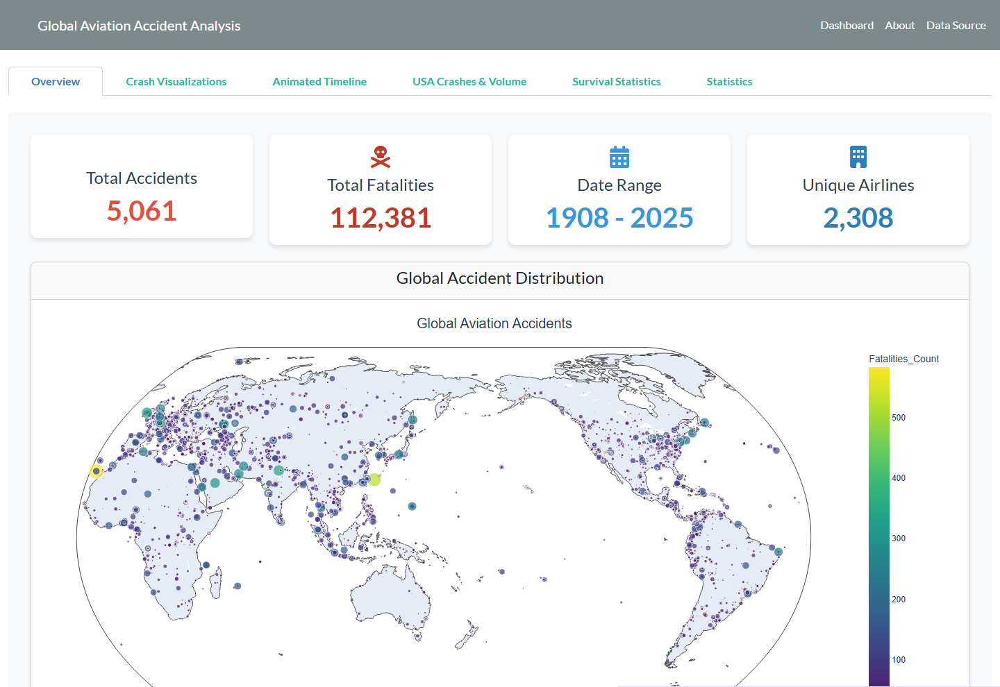

# Aviation Accidents Dashboard

An interactive Dash application over a century of aviation accident records:
5,061 accidents from 1908 to 2025, built on a dataset scraped and geocoded for
this project.



## Overview

Aviation accident data exists publicly but not in an analysable form: it lives in
per-year HTML pages, with free-text locations, inconsistent `?` placeholders for
missing values, and casualty counts embedded in prose like
`2 (passengers:1 crew:1)`.

This project does the whole chain: scrape, parse, geocode, explore, present.

1. A scraper walks planecrashinfo.com year by year and extracts every record.
2. A geocoder resolves the free-text locations to coordinates via Nominatim, with
   an on-disk cache so re-runs cost nothing and the 1 req/s policy is respected.
3. A notebook cleans the result and cross-references it with US domestic flight
   history (1987–2008) to put accident counts in the context of traffic volume.
4. A six-tab Dash app presents it: maps, timelines, airline and aircraft
   breakdowns, and survival analysis.

## Approach

**Scraping** (`scripts/webscrape_plane_crashes.py`): BeautifulSoup over the
per-year index pages, with randomised delays between requests. Produces a 13-column
CSV: date, time, location, operator, flight number, route, aircraft type,
registration, construction number, aboard, fatalities, ground casualties, summary.

**Geocoding** (`scripts/coordinates_mapper_script.py`): Nominatim via geopy with
a 1.1 s delay, retry on timeout, incremental CSV cache and a run log. The cache
holds 7,680 resolved location strings, and 4,754 accidents end up with usable
coordinates. The cache is committed, so the geocoding does not need re-running.

**Flight context**: the ASA Data Expo airline on-time dataset (1987–2008) is
aggregated into origin–destination route counts, letting the dashboard show
accident density against traffic density rather than raw counts. Reference tables
(1,491 carriers, 5,029 aircraft tail numbers, US airport coordinates) join codes
to names.

**Dashboard** (`app.py`, ~2,000 lines): Dash + Plotly + Bootstrap, six tabs:

| Tab | Content |
|---|---|
| Overview | headline metrics and a global scatter-geo of accidents scaled by fatalities |
| Crash Visualizations | folium marker-cluster and heat maps, route overlays |
| Animated Timeline | accidents over time as an animated Plotly frame sequence |
| USA Crashes & Volume | accident density against flight-route density |
| Survival Statistics | survival rate by decade, and by aircraft type (min. 5 incidents) |
| Statistics | accidents and fatalities by year/decade, top airlines by accidents |

## Dataset

- **Accidents**: scraped from [planecrashinfo.com](https://www.planecrashinfo.com/),
  5,061 records, 1908-09-17 to 2025-03-17. Committed under
  `data/crashes_data/` along with the geocoding cache.
- **US flight history**: the ASA Data Expo 2009 airline on-time dataset,
  1987–2008. The yearly archives total roughly 1.5 GB and are **not committed**.
  Only the derived route counts and the small reference tables (airports,
  carriers, aircraft) are, which is everything the dashboard needs.

## Running the Project

```bash
pip install -r requirements.txt
python app.py
```

Then open <http://127.0.0.1:8053>. The app reads only the committed CSVs and
generates its folium maps into `assets/` on first render, so no data download
or API key is needed.

Verified end-to-end (all six tabs render without errors) on Dash 4.4.1,
Plotly 7.0.0, dash-bootstrap-components 2.0.4 and folium 0.20.0.

To re-run the data collection instead of using the committed CSVs (from the
repository root):

```bash
python scripts/webscrape_plane_crashes.py      # re-scrape the accident database
python scripts/coordinates_mapper_script.py    # geocode new locations (cached)
```

Geocoding respects Nominatim's 1 req/s limit, so a cold run over all locations
takes hours. Set `GEOCODER_USER` to identify yourself in the user agent, as
Nominatim's usage policy requires.

To re-run the flight-volume aggregation in
`data_preparation_and_eda.ipynb`, download the yearly `.csv.bz2` files from the
[ASA Data Expo dataset](https://community.amstat.org/jointscsg-section/dataexpo/dataexpo2009)
into `data/flights_data/`. Without them, that one cell reports no files found and
the notebook falls back to the committed `all_flight_routes_counts.csv`.

## Repository Structure

```
app.py                              the Dash application
data_preparation_and_eda.ipynb      cleaning, joins, flight aggregation, EDA
scripts/
  webscrape_plane_crashes.py        accident database scraper
  coordinates_mapper_script.py      Nominatim geocoder with disk cache
data/
  crashes_data/                     scraped accidents + geocoding cache
  flights_data/                     route counts and reference tables
assets/                             folium maps, generated at runtime
images/                             static map used by the Overview tab
figures/                            EDA figures
docs/                               README screenshot
```

## Tech Stack

Python · Dash · Plotly · dash-bootstrap-components · folium · pandas · NumPy ·
BeautifulSoup · geopy/Nominatim

## Limitations

- planecrashinfo.com skews toward commercial and military aviation; general
  aviation is under-represented, so absolute counts are not a complete census.
- Roughly 300 accidents have no usable coordinates (4,754 of 5,060 placed in the
  committed run), because free-text locations like "off the coast of..." do not
  geocode. Those records are missing from the maps but present in the time-series
  and statistics tabs.
- Accident-versus-volume comparisons only cover 1987–2008 (1,295 accidents), the
  span of the flight dataset; the rest of the record has no traffic baseline.
- Survival rates are computed from the aboard/fatalities columns as scraped, and
  those fields are missing or ambiguous for many older records.
- The notebook's stored outputs come from a slightly earlier scrape (5,060
  records) than the committed CSV (5,061). Re-running reproduces the current
  numbers.
- Original Plotly axis and colorbar keywords (`titlefont`, `titleside`) were
  removed in Plotly 5; they have been ported to the current API so the app runs
  on today's versions. No figure content changed.

## Context

Developed with Alexandre Ferreira for the Data Visualisation and Analysis course
of the MSc in Artificial Intelligence and Data Science, University of Coimbra
(2024/2025).

## License

Released under the MIT License — see [`LICENSE`](LICENSE). Copyright is shared
with Alexandre Ferreira, who co-authored the project.
